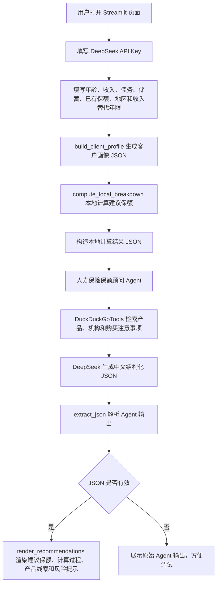

## 人寿保险保额顾问

这个应用是一个人寿保险保额顾问 Streamlit 应用，使用 DeepSeek 模型服务、DuckDuckGo 网页搜索和本地确定性保额计算，帮助用户估算定期寿险需求，并整理相关产品或购买渠道线索。

### 功能

- 支持 DeepSeek API
- 使用本地 Python 函数计算建议保额
- 通过 DuckDuckGo 检索定期寿险产品、保险机构和购买注意事项
- 展示保额计算输入、计算过程、模型假设和产品线索
- 提供本地 Streamlit 交互式界面

### 快速开始

1. 进入项目目录

```bash
cd 05-ai_life_insurance_advisor_agent
```

2. 安装依赖

```bash
pip install -r requirements.txt
```

3. 配置模型服务

在 `05-ai_life_insurance_advisor_agent/.env` 或仓库根目录 `awesome-llm-apps/.env` 中填入你的 DeepSeek API key、服务地址和模型名：

```bash
DEEPSEEK_API_KEY=你的DeepSeek API Key
DEEPSEEK_BASE_URL=https://api.deepseek.com
DEEPSEEK_MODEL_ID=deepseek-chat
```

如果需要使用其他 DeepSeek 模型，可以把 `DEEPSEEK_MODEL_ID` 设置为服务支持的模型名，例如 `deepseek-chat`、`deepseek-reasoner`、`deepseek-v4-flash` 或 `deepseek-v4-pro`。

4. 运行 Streamlit 应用

```bash
streamlit run life_insurance_advisor_agent.py
```

也可以从 `awesome-llm-apps` 仓库根目录运行：

```bash
./scripts/run_05_agent.sh
```

启动成功后，浏览器会打开本地页面：

```text
http://localhost:8501
```

### 示例输入

可以在页面中尝试下面这些输入：

- **年龄**：35
- **年收入**：85000
- **需要供养的人数**：2
- **国家或地区**：United States
- **未偿债务总额**：200000
- **可供家庭使用的储蓄和投资资产**：50000
- **已有寿险保额**：100000
- **收入替代年限**：10

也可以尝试中国语境：

- **年龄**：38
- **年收入**：300000
- **需要供养的人数**：3
- **国家或地区**：中国 上海
- **未偿债务总额**：1800000
- **可供家庭使用的储蓄和投资资产**：300000
- **已有寿险保额**：500000
- **币种**：USD 或按页面可选币种选择
- **收入替代年限**：10

### 代码流程图



核心数据流：

- `build_client_profile()`：把页面表单整理为客户画像。
- `compute_local_breakdown()`：用本地 Python 公式计算收入替代现值、债务覆盖、资产抵扣和建议保额。
- `get_agent()`：创建 DeepSeek Agent，并挂载 DuckDuckGo 搜索工具。
- `extract_json()`：解析 Agent 返回的 JSON。
- `render_recommendations()`：把保额、表格、产品线索和风险提示渲染到 Streamlit 页面。

### 访问方式说明

`http://localhost:8501` 是本地 Streamlit 页面。这个项目不是 AgentOS API 服务，因此不需要连接本地 AgentUI。

如果页面无法使用，可按下面顺序排查：

1. 确认终端中 `streamlit run life_insurance_advisor_agent.py` 正常运行。
2. 打开 `http://localhost:8501`。
3. 确认页面中已经填写 DeepSeek API Key，或 `.env` 中已经配置对应变量。

> 本项目仅用于技术学习与原型验证，不构成投资、保险、税务或法律建议。请向持牌专业人士核验保额和产品信息，并以保险公司正式披露为准。
