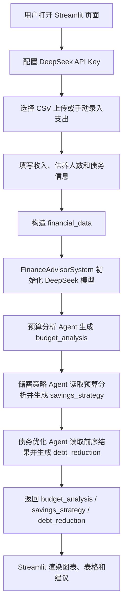

## AI 财务教练

这个应用是一个 Streamlit 个人财务教练，使用 Agno 和 DeepSeek，通过预算分析、储蓄策略、债务优化三个 Agent 依次分析用户的收入、支出、债务和家庭情况，并生成结构化财务建议。

### 功能

- 支持 DeepSeek API
- 使用 Agno 编排三段式 Agent 流程
- 预算分析 Agent：分析支出结构并提出预算优化建议
- 储蓄策略 Agent：计算应急金规模，并制定储蓄分配方案
- 债务优化 Agent：比较雪崩法和雪球法，生成还债计划
- 支持上传 CSV 交易流水或手动录入支出
- 使用 Plotly 展示支出结构、收入支出对比和债务图表
- 提供本地 Streamlit 交互式界面

### 快速开始

1. 进入项目目录

```bash
cd 06-ai_financial_coach_agent
```

2. 安装依赖

```bash
pip install -r requirements.txt
```

3. 配置模型服务

在 `06-ai_financial_coach_agent/.env` 或仓库根目录 `awesome-llm-apps/.env` 中填入你的 DeepSeek API key、服务地址和模型名：

```bash
DEEPSEEK_API_KEY=你的DeepSeek API Key
DEEPSEEK_BASE_URL=https://api.deepseek.com
DEEPSEEK_MODEL_ID=deepseek-chat
```

如果需要使用其他 DeepSeek 模型，可以把 `DEEPSEEK_MODEL_ID` 设置为服务支持的模型名，例如 `deepseek-chat`、`deepseek-reasoner`、`deepseek-v4-flash` 或 `deepseek-v4-pro`。

4. 运行 Streamlit 应用

```bash
streamlit run ai_financial_coach_agent.py
```

也可以从 `awesome-llm-apps` 仓库根目录运行：

```bash
./scripts/run_06_agent.sh
```

启动成功后，浏览器会打开本地页面：

```text
http://localhost:8501
```

### CSV 文件格式

如果选择上传交易流水，CSV 需要包含以下列：

- `Date`：交易日期，格式为 `YYYY-MM-DD`
- `Category`：支出类别
- `Amount`：交易金额，支持普通数字格式

示例：

```csv
Date,Category,Amount
2024-01-01,Housing,1200.00
2024-01-02,Food,150.50
2024-01-03,Transportation,45.00
```

页面侧边栏也提供 CSV 模板下载。

### 示例输入

可以直接使用页面默认值测试：

- **月收入**：25000
- **供养人数**：2
- **住房**：6000
- **水电燃气**：800
- **餐饮**：4500
- **交通**：1200
- **医疗**：600
- **娱乐**：1000
- **个人消费**：1800
- **储蓄**：4000
- **其他**：900
- **债务 1**：信用卡，余额 50000，年利率 18%，最低月还款 3000
- **债务 2**：贷款 2，余额 120000，年利率 6%，最低月还款 2500

### 示例场景

这个项目是表单式 Streamlit 应用，不是聊天式 AgentUI。可以把下面的问题转成页面输入来测试：

- 我每月税后收入 25000，家庭供养 2 人，应该保留多少应急金？
- 我每月支出大约 16800，当前储蓄 4000，预算结构是否健康？
- 我有 50000 信用卡债务，年利率 18%，还有 120000 贷款，年利率 6%，应该先还哪一笔？
- 如果我想每月多存 3000，哪些支出类别最适合优先压缩？
- 雪崩法和雪球法分别适合什么情况？当前债务结构下哪个更省利息？
- 当前收入、支出和债务组合下，是否存在现金流风险？
- 如果餐饮、娱乐、个人消费较高，系统会给出哪些预算优化建议？
- 上传 CSV 交易流水后，系统能否自动汇总支出类别并生成图表？

### 代码流程图



核心数据流：

- `parse_csv_transactions()`：将 CSV 交易流水转换为交易列表和类别汇总。
- `FinanceAdvisorSystem.analyze_finances()`：依次运行预算分析、储蓄策略和债务优化三个 Agent。
- `预算分析 Agent`：输出 `budget_analysis`。
- `储蓄策略 Agent`：读取预算分析并输出 `savings_strategy`。
- `债务优化 Agent`：读取预算和储蓄策略并输出 `debt_reduction`。
- `display_*()`：将三个分析结果渲染为 Streamlit 图表和文字建议。

### 访问方式说明

`http://localhost:8501` 是本地 Streamlit 页面。这个项目不是 AgentOS API 服务，因此不需要连接本地 AgentUI。

如果页面无法使用，可按下面顺序排查：

1. 确认终端中 `streamlit run ai_financial_coach_agent.py` 正常运行。
2. 打开 `http://localhost:8501`。
3. 确认 `.env` 中已经配置 `DEEPSEEK_API_KEY`。

> 本项目仅用于技术学习与原型验证，不构成投资、税务、保险或法律建议。
