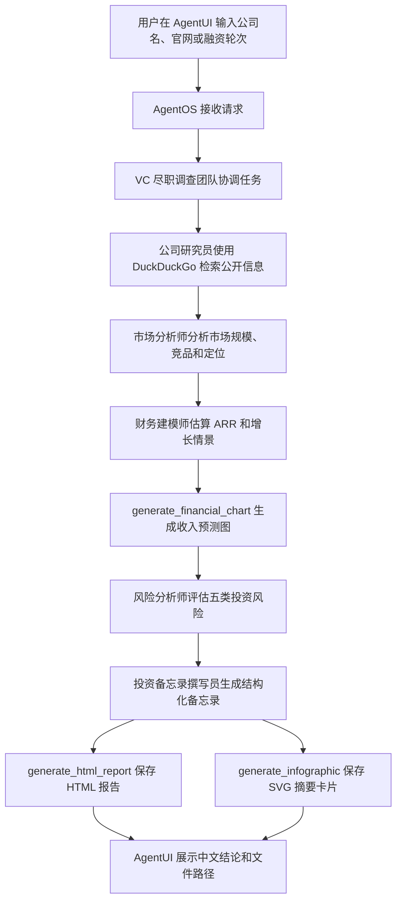

## AI VC 尽职调查 Agent 团队

这个应用是一个创业公司投资尽调 Agent 团队，使用 DeepSeek 模型服务，并结合 DuckDuckGo 网页搜索、本地图表生成、HTML 报告和 SVG 摘要卡片，生成结构化 VC 投资分析结果。

### 功能

- 支持 DeepSeek API
- 公司研究员负责检索公司官网、融资、团队、产品和近期动态
- 市场分析师负责分析市场规模、竞争格局、定位和行业趋势
- 财务建模师负责估算 ARR、增长情景、退出倍数和回报区间
- 风险分析师负责评估市场、执行、财务、监管和退出风险
- 投资备忘录撰写员负责生成投资备忘录、HTML 报告和 SVG 摘要卡片
- 通过 DuckDuckGo 进行网页搜索，不需要额外搜索 API 账号
- 使用 AgentOS 和本地 AgentUI 进行图形化交互

### 快速开始

1. 进入项目目录

```bash
cd 07-ai_vc_due_diligence_agent_team
```

2. 安装依赖

```bash
pip install -r requirements.txt
```

3. 配置模型服务

在 `07-ai_vc_due_diligence_agent_team/.env` 或仓库根目录 `awesome-llm-apps/.env` 中填入你的 DeepSeek API key、服务地址和模型名：

```bash
DEEPSEEK_API_KEY=你的DeepSeek API Key
DEEPSEEK_BASE_URL=https://api.deepseek.com
DEEPSEEK_MODEL_ID=deepseek-chat
```

如果需要使用其他 DeepSeek 模型，可以把 `DEEPSEEK_MODEL_ID` 设置为服务支持的模型名，例如 `deepseek-chat`、`deepseek-reasoner`、`deepseek-v4-flash` 或 `deepseek-v4-pro`。

4. 运行 AgentOS API

```bash
python agent.py
```

也可以从 `awesome-llm-apps` 仓库根目录运行：

```bash
./scripts/run_07_agent.sh
```

启动成功后，本地服务会运行在：

```text
http://localhost:7777
```

直接访问这个地址会看到 AgentOS API 信息。要使用图形化聊天界面，请在工作区根目录启动本地 AgentUI：

```bash
cd ..
./scripts/run_agent_ui.sh
```

然后打开：

```text
http://localhost:3000
```

并在 AgentUI 中连接本地 AgentOS 服务：

```text
http://localhost:7777
```

也可以先用本地 API 文档确认 AgentOS 服务正常：

```text
http://localhost:7777/docs
```

### 示例问题

可以在 AgentUI 中尝试下面这些问题：

- 请对 Cursor 做一份 Series A 投资尽调，重点分析市场、竞品、风险和估值区间。
- 请分析 https://replit.com 是否适合作为成长轮投资机会，并生成投资备忘录。
- 研究 Lovable 的产品、融资、竞争格局和潜在退出路径。
- 请对 Perplexity 做 VC 尽调，区分公开确认信息和估计信息。
- 请分析一个早期 AI 编程工具公司的投资机会，重点评估市场风险和执行风险。
- 请为 https://v0.dev 生成公司研究、市场分析、财务情景预测和投资建议。
- 比较一个 AI Agent 平台与传统 SaaS 工具的市场机会和风险差异。
- 请生成一份适合投委会讨论的创业公司投资备忘录，并保存本地报告文件。

### 生成文件

工具生成的文件会保存到项目目录下的 `outputs/`：

```text
07-ai_vc_due_diligence_agent_team/outputs/
```

可能生成的文件包括：

- `revenue_chart_*.png`：保守、基准、乐观三种 ARR 情景预测图
- `investment_report_*.html`：本地 HTML 投资尽调报告
- `infographic_*.svg`：本地 SVG 投资摘要卡片

这些文件是本地生成的，不依赖外部图片生成服务。

### 代码流程图



核心数据流：

- `company_research_agent`：输出公司概况、团队、融资、产品、牵引力和信息缺口。
- `market_analysis_agent`：输出市场机会、竞品、定位差异和趋势风险。
- `financial_modeling_agent`：调用 `generate_financial_chart()`，保存收入预测图。
- `risk_assessment_agent`：输出五类风险、总体风险评分和保护性条款建议。
- `memo_agent`：调用 `generate_html_report()` 和 `generate_infographic()`，保存本地报告文件。
- `due_diligence_team`：协调所有成员，并输出最终中文投资分析。

### 访问方式说明

`http://localhost:7777` 是本地 AgentOS API 服务，不是聊天网页。直接打开它通常只会看到类似下面的 JSON，表示服务已经启动：

```json
{"name":"AgentOS API","id":"...","version":"1.0.0"}
```

图形化聊天界面由工作区内的本地 AgentUI 提供：

```text
http://localhost:3000
```

本地 Python 进程负责运行 Agent、Team、网页搜索和文件生成工具，AgentUI 负责展示聊天、会话和运行管理界面。AgentUI 连接的本地 AgentOS 地址是：

```text
http://localhost:7777
```

如果聊天界面无法使用，可按下面顺序排查：

1. 打开 `http://localhost:7777/docs`，能看到 Swagger 页面说明本地服务正常。
2. 打开 `http://localhost:3000`，确认本地 AgentUI 正常启动。
3. 在 AgentUI 中连接 `http://localhost:7777`。
4. 确认 `.env` 中已经配置 `DEEPSEEK_API_KEY`。

> 本项目仅用于技术学习与原型验证，不构成投资、税务、保险或法律建议。
