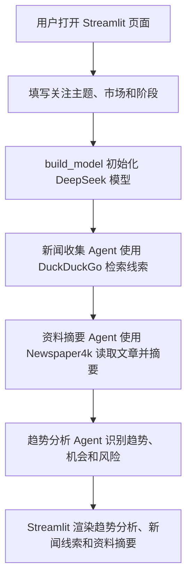

## AI 创业趋势分析 Agent

这个应用是一个 Streamlit 创业趋势分析工具，使用 DeepSeek、DuckDuckGo 和 Newspaper4k，围绕用户输入的赛道或技术方向收集创业新闻、融资事件、产品发布和市场线索，并生成中文趋势分析与创业机会建议。

### 功能

- 支持 DeepSeek API
- 可选通过 DuckDuckGo 检索创业、融资、产品和市场新闻
- 可选通过 Newspaper4k 读取文章并提取摘要
- 三段式 Agent 流程：新闻收集、资料摘要、趋势分析
- 输出趋势对比表、市场空白、目标客户、进入难度、风险和验证实验
- 提供本地 Streamlit 交互式界面
- 默认关闭联网工具，仅使用 DeepSeek，避免搜索站点不可达导致流程失败

### 快速开始

1. 进入项目目录

```bash
cd 08-ai_startup_trend_analysis_agent
```

2. 安装依赖

```bash
pip install -r requirements.txt
```

3. 配置模型服务

在 `08-ai_startup_trend_analysis_agent/.env` 或仓库根目录 `awesome-llm-apps/.env` 中填入你的 DeepSeek API key、服务地址和模型名：

```bash
DEEPSEEK_API_KEY=你的DeepSeek API Key
DEEPSEEK_BASE_URL=https://api.deepseek.com
DEEPSEEK_MODEL_ID=deepseek-chat
```

如果需要使用其他 DeepSeek 模型，可以把 `DEEPSEEK_MODEL_ID` 设置为服务支持的模型名，例如 `deepseek-chat`、`deepseek-reasoner`、`deepseek-v4-flash` 或 `deepseek-v4-pro`。

4. 运行 Streamlit 应用

```bash
streamlit run startup_trends_agent.py
```

也可以从 `awesome-llm-apps` 仓库根目录运行：

```bash
./scripts/run_08_agent.sh
```

启动成功后，浏览器会打开本地页面：

```text
http://localhost:8501
```

页面中的“使用联网搜索和文章读取”默认关闭。打开后才会访问 DuckDuckGo 和新闻站点；如果本地网络无法访问这些站点，保持关闭即可使用离线趋势分析。

### 示例输入

可以在页面中尝试下面这些主题：

- AI Agent 在金融投研和企业自动化中的创业机会
- 稳定币支付基础设施的早期创业机会
- 中小企业财务自动化 SaaS 的市场空白
- 机器人流程自动化和多模态 Agent 的结合机会
- AI 原生 CRM 和销售自动化趋势
- 量化投研工具面向个人投资者的产品机会
- 企业知识库、RAG 和智能搜索的新机会
- 保险科技中的智能核保和理赔自动化趋势

### 代码流程图



核心数据流：

- `build_model()`：读取 `.env`，初始化 DeepSeek 模型。
- `build_agents()`：创建新闻收集、资料摘要和趋势分析三个 Agent。
- `新闻收集 Agent`：检索创业新闻、融资事件、产品发布和监管变化。
- `资料摘要 Agent`：读取文章并整理证据、影响和不确定性。
- `趋势分析 Agent`：输出趋势对比表、创业机会、风险和验证实验。

### 访问方式说明

`http://localhost:8501` 是本地 Streamlit 页面。这个项目不是 AgentOS API 服务，因此不需要连接本地 AgentUI。

如果页面无法使用，可按下面顺序排查：

1. 确认终端中 `streamlit run startup_trends_agent.py` 正常运行。
2. 打开 `http://localhost:8501`。
3. 确认 `.env` 中已经配置 `DEEPSEEK_API_KEY`。
4. 联网模式下如果网页读取失败，先关闭“使用联网搜索和文章读取”，使用 DeepSeek 离线分析。

> 本项目仅用于技术学习与原型验证，不构成投资、税务、保险或创业建议。
