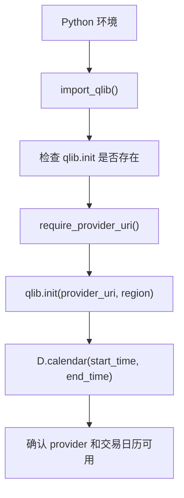

# 01：先把 Qlib 环境和数据入口跑通

这一节只验证两件事：当前导入的是 Microsoft `pyqlib`，并且 `QLIB_PROVIDER_URI` 指向一个 Qlib provider。没有 provider 就直接失败，因为后续所有示例都要经过 Qlib 的数据层。

## 图结构



## Python 文件逐段拆解

### `import_qlib()`

这个函数来自 `qlib_demo_common.py`。它先 `import qlib`，然后检查模块里是否有 `qlib.init`。

这个检查很重要：Python 生态里存在另一个同名 `qlib` 包。如果导入错包，后续 `D.features`、`DataHandlerLP`、`DatasetH` 都不可用。这里用 `qlib.init` 作为 Microsoft `pyqlib` 的最低可用性判断。

### `require_provider_uri()`

读取环境变量：

```bash
QLIB_PROVIDER_URI=~/.qlib/qlib_data/cn_data
```

Qlib provider 不是普通 CSV 目录，而是 Qlib 数据层能读取的目录。它通常包含交易日历、标的池和特征存储。这个函数的原则是：没有 provider 就失败，不回退到本地样本。

### `init_qlib()`

内部调用：

```python
qlib.init(provider_uri=provider_uri, region=region)
```

`qlib.init` 是 Qlib 全局数据环境初始化入口。它把 provider 路径、市场区域、交易规则等上下文注册到 Qlib 的全局配置里。后续 `D.calendar`、`D.features`、`QlibDataLoader` 都依赖这个初始化状态。

### `D.calendar(...)`

`D.calendar` 从 provider 读取交易日历。它不是为了做研究指标，而是用于确认：

- provider 路径可读；
- 起止日期内存在交易日；
- Qlib 数据层已经初始化成功。

## 一次运行的完整执行轨迹

1. 脚本导入 `qlib_demo_common`。
2. `import_qlib()` 确认当前 `qlib` 是 Microsoft `pyqlib`。
3. `init_qlib()` 读取 `QLIB_PROVIDER_URI` 和 `QLIB_REGION` 并初始化 Qlib。
4. `D.calendar()` 读取指定日期范围内的交易日历。
5. 终端打印 provider、market、date range 和 calendar range。

## 运行方式

```bash
QLIB_PROVIDER_URI=~/.qlib/qlib_data/cn_data python environment_and_data.py
```

可选：

```bash
QLIB_REGION=cn
QLIB_MARKET=csi300
QLIB_START_TIME=2020-01-01
QLIB_END_TIME=2020-12-31
```

## 常见坑

- 安装了错误的 `qlib` 包，导致 `qlib.init` 不存在。
- `QLIB_PROVIDER_URI` 指向普通 CSV 目录。
- provider 有数据，但日期范围内没有交易日。

## 下一步

进入 `02-qlib-data-api`，用 `D.features` 从 provider 中读取真实字段。
