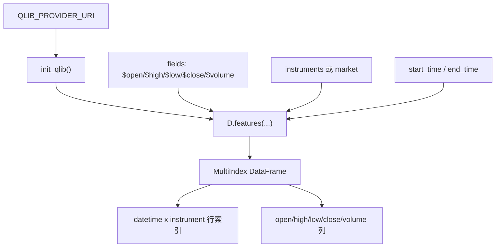

# 02：第一次读取 Qlib 数据

这一节使用 Qlib 原生数据入口 `D.features` 读取 OHLCV 字段。它是后续表达式、因子、标签、模型和回测的最底层数据入口。

## 图结构



## Python 文件逐段拆解

### `fields` 和 `names`

脚本里定义：

```python
fields = ["$open", "$high", "$low", "$close", "$volume"]
names = ["open", "high", "low", "close", "volume"]
```

`$open` 这类字段是 Qlib 表达式语言里的基础字段引用。`names` 是输出 DataFrame 的列名，方便后续阅读。

### `load_features(...)`

`load_features` 来自 `qlib_demo_common.py`，内部调用：

```python
D.features(
    instruments=instruments(),
    fields=list(fields),
    start_time=start_time(),
    end_time=end_time(),
    freq="day",
)
```

`D.features` 的作用是：根据股票池、字段表达式、时间范围和频率，从 provider 中取出对齐后的特征表。这里的 `fields` 可以是基础字段，也可以是复杂表达式，后续章节会扩展这一点。

### `instruments()`

默认返回 `QLIB_MARKET`，例如 `csi300`。如果设置了：

```bash
QLIB_INSTRUMENTS=SH600000,SZ000001
```

则只读取指定标的。自动因子评估通常更适合使用股票池，而不是单标的，因为 IC/RankIC 依赖横截面。

### `with_datetime_instrument_index(...)`

Qlib 返回的 MultiIndex 层级在不同接口或配置下可能是 `instrument, datetime` 或 `datetime, instrument`。这个 helper 把索引统一成：

```text
datetime, instrument
```

这样后续按日期 `groupby(level="datetime")` 计算 IC 时更稳定。

## 一次运行的完整执行轨迹

1. 初始化 Qlib provider。
2. 把基础字段交给 `D.features`。
3. Qlib 从 provider 读取数据并按交易日、标的对齐。
4. 脚本重命名列并统一 MultiIndex 顺序。
5. 打印前几行、索引名和列名。

## 运行方式

```bash
QLIB_PROVIDER_URI=~/.qlib/qlib_data/cn_data python qlib_data_api.py
```

可选：

```bash
QLIB_MARKET=csi300
QLIB_INSTRUMENTS=SH600000,SZ000001
QLIB_START_TIME=2020-01-01
QLIB_END_TIME=2020-12-31
```

## 常见坑

- instruments 名称和 provider 的股票代码格式不一致。
- 日期范围太短，后续滚动表达式大量为空。
- 单标的数据能读取，但不适合做横截面 IC。

## 下一步

进入 `03-qlib-expressions`，把基础字段扩展成 `Ref`、`Mean`、`Std`、`Rank` 等 Qlib 表达式。
