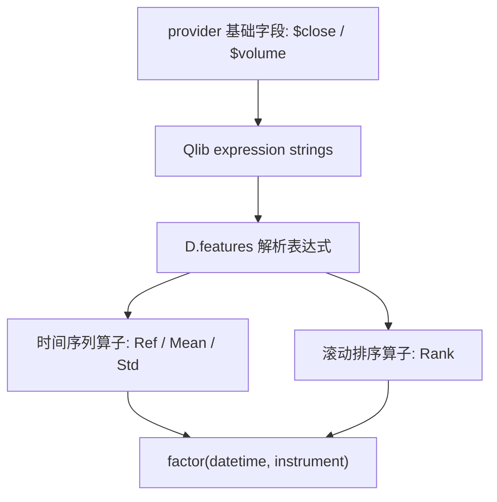
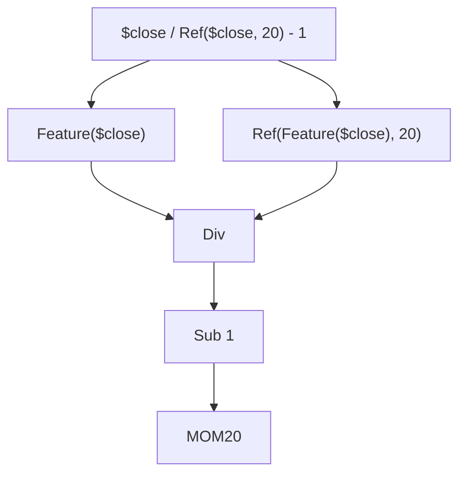

# 03：Qlib 表达式引擎

这一节把表达式字符串交给 Qlib `D.features` 计算。重点不是记语法，而是理解表达式如何把基础行情字段变成因子矩阵。

## 图结构



表达式树可以这样理解：



## Python 文件逐段拆解

### `fields`

脚本定义一组 Qlib 表达式：

```python
fields = [
    "$close",
    "Ref($close, 1)",
    "$close / Ref($close, 20) - 1",
    "Mean($close, 20) / $close",
    "Std($close / Ref($close, 1) - 1, 20)",
    "Mean($volume, 5) / Mean($volume, 20)",
    "Rank($close / Ref($close, 20) - 1, 20)",
]
```

这些字符串会被 Qlib 表达式引擎解析。`D.features` 不是把字符串拼成 Python 代码执行，而是用 Qlib 内部算子计算每个字段。

### `Ref`

`Ref($close, 1)` 表示向过去取一个交易周期的收盘价。它适合放在 feature 中。

`Ref($close, -5)` 表示引用未来数据，只能用于 label 或事后评估，不能作为预测特征。

### `Mean` / `Std`

这两个是时间序列窗口算子。它们在每只股票自己的历史序列上滚动计算，不会把不同股票的数据串起来。

### `Rank`

`Rank(feature, N)` 是时间序列滚动排序算子，表示当前值在该标的最近 `N` 个周期中的百分位。本例使用 `N=20`，计算 20 日动量在自身最近 20 个交易日中的相对位置。

Qlib 0.9.7 的表达式引擎没有 `CSRank` 算子。横截面排名应在 `D.features` 返回数据后按 `datetime` 分组计算；第 6 节的 RankIC 正是这样实现的。

### `load_features(fields, names)`

脚本仍然通过 `load_features` 调用 `D.features`。这说明 Qlib 的 Data API 不只读取原始字段，也负责表达式计算。

## 一次运行的完整执行轨迹

1. 初始化 Qlib provider。
2. 把表达式列表传给 `D.features`。
3. Qlib 根据 provider 字段计算 Ref、Mean、Std 和带窗口参数的 Rank。
4. 返回 `datetime, instrument` MultiIndex DataFrame。
5. 脚本丢掉空值并打印前几行。

## 运行方式

```bash
QLIB_PROVIDER_URI=~/.qlib/qlib_data/cn_data python qlib_expressions.py
```

## 常见坑

- 把 `Ref($close, -5)` 写进 feature，造成未来函数。
- 忘记给 `Rank(feature, N)` 传窗口参数 `N`。
- 把表达式里的滚动 `Rank` 误当成横截面排名。
- 日期范围太短，20 日窗口特征前期会为空。

## 下一步

进入 `04-data-handler-and-dataset`，把表达式组织成 feature / label config，并交给 Qlib 的 Handler 和 Dataset。
