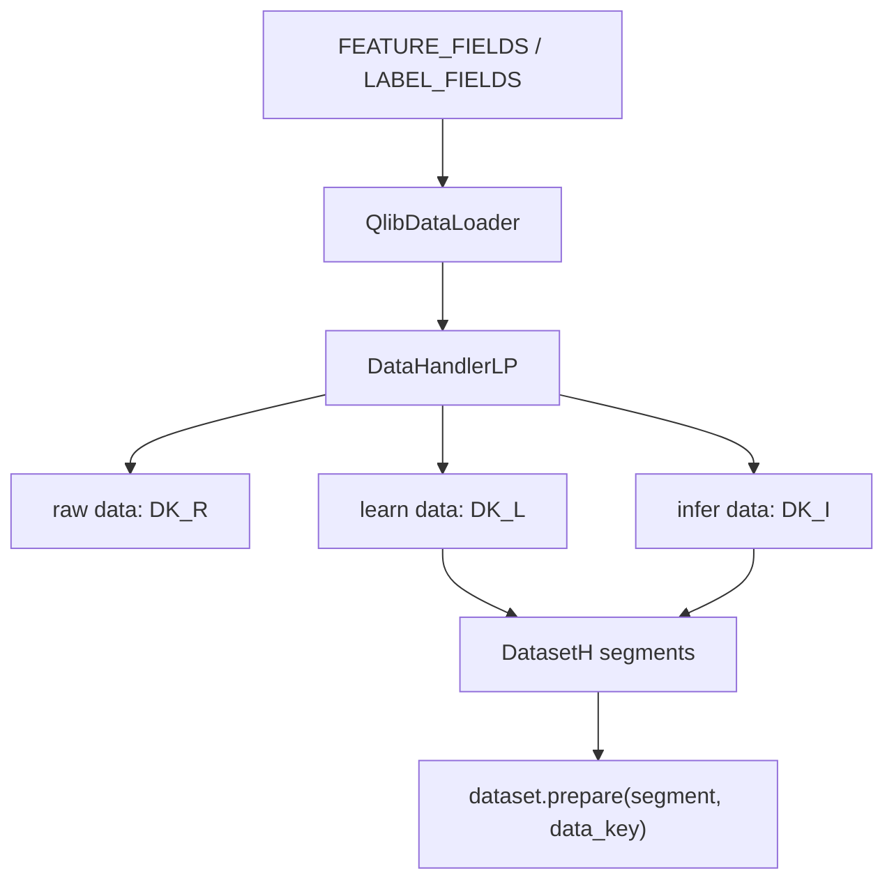

# 04：Qlib DataHandlerLP 和 DatasetH

这一节第一次把 feature、label、processor 和时间切分放进 Qlib 原生数据集对象。它是从“能读取表达式”走向“能训练模型”的关键层。

## 图结构



## Python 文件逐段拆解

### `FEATURE_FIELDS` / `LABEL_FIELDS`

脚本把 Qlib 表达式分成两组：

```python
FEATURE_FIELDS = [...]
LABEL_FIELDS = ["Ref($close, -2) / Ref($close, -1) - 1"]
```

feature 表达式只能使用当前和历史信息。label 表达式可以引用未来，因为它是训练目标和评估目标。

### `QlibDataLoader`

在 `DataHandlerLP` 的 `data_loader` 配置中：

```python
"class": "QlibDataLoader",
"kwargs": {
    "config": {
        "feature": (FEATURE_FIELDS, FEATURE_NAMES),
        "label": (LABEL_FIELDS, LABEL_NAMES),
    }
}
```

`QlibDataLoader` 的作用是把 feature / label 配置交给 Qlib 数据层，批量调用表达式引擎并生成多列 DataFrame。它回答的问题是：**加载哪些字段和表达式？**

### `DataHandlerLP`

`DataHandlerLP` 负责维护不同用途的数据视图：

```text
DK_R：raw，原始加载结果
DK_I：infer，推理使用的数据
DK_L：learn，训练使用的数据
```

它回答的问题是：**原始数据如何处理成训练和推理可用的数据？**

### `learn_processors`

本节配置了：

```python
learn_processors=[{"class": "DropnaLabel"}]
```

`DropnaLabel` 会删除 label 为空的训练样本。Processor 的核心原则是：训练数据和推理数据的处理规则要明确，避免标签缺失、无穷值或标准化泄漏。

### `DatasetH`

`DatasetH` 接收 handler 和 segments：

```python
segments={
    "train": (start_time(), train_end_time()),
    "test": (test_start_time(), end_time()),
}
```

它回答的问题是：**训练、验证、测试分别取哪个时间段？**

### `dataset.prepare(...)`

脚本分别读取 `DK_R` 和 `DK_L`：

```python
dataset.prepare("train", col_set=["feature", "label"], data_key=data_key)
```

这能直接观察 raw 数据和 learn 数据的区别。`segment` 是时间切片，`data_key` 是处理流水线，两者不要混淆。

## 一次运行的完整执行轨迹

1. 初始化 Qlib。
2. `QlibDataLoader` 根据 feature / label 表达式读取数据。
3. `DataHandlerLP` 构造 raw / learn / infer 数据视图。
4. `DatasetH` 保存 train/test 时间段。
5. `dataset.prepare` 输出模型可用的 feature / label 表。

## 运行方式

```bash
QLIB_PROVIDER_URI=~/.qlib/qlib_data/cn_data python data_handler_and_dataset.py
```

## 常见坑

- 把 `DK_L/DK_I` 和 `train/test` 混为一谈。
- label 缺失没有处理，导致训练样本异常。
- Processor 在全样本上 fit，造成数据泄漏。

## 下一步

进入 `05-labels-and-time-splits`，单独检查标签方向和时间切分。
