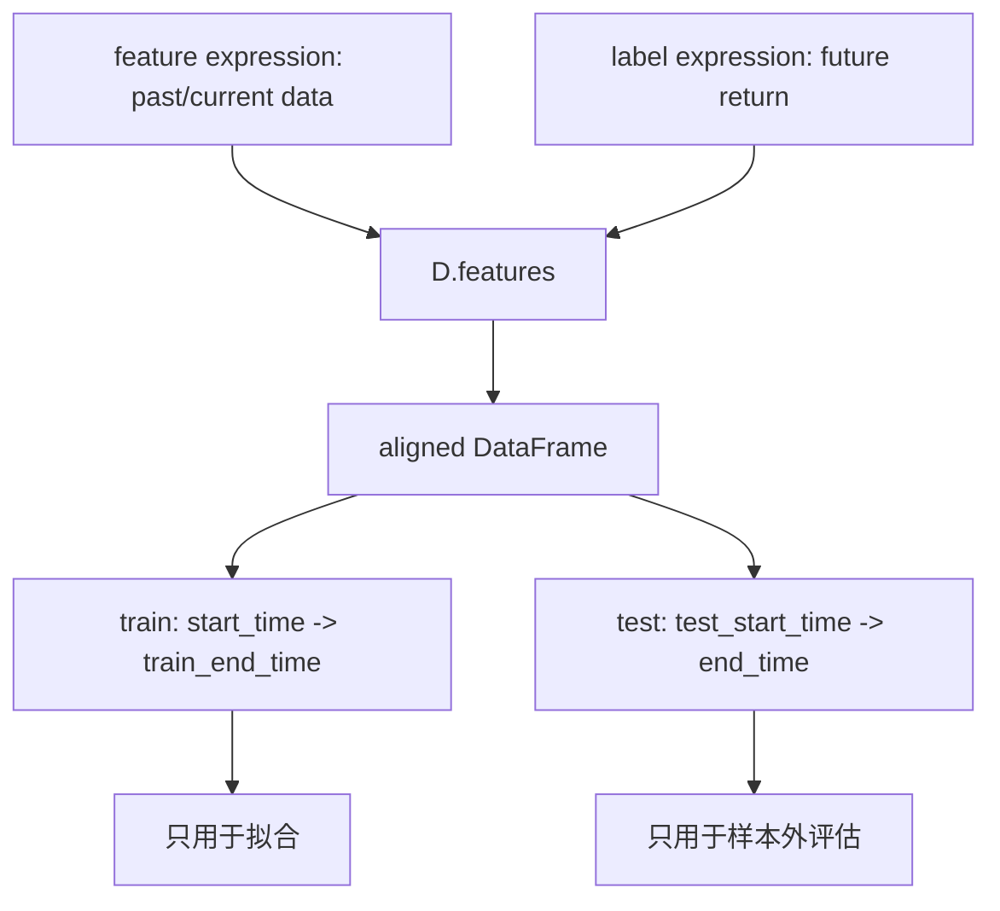
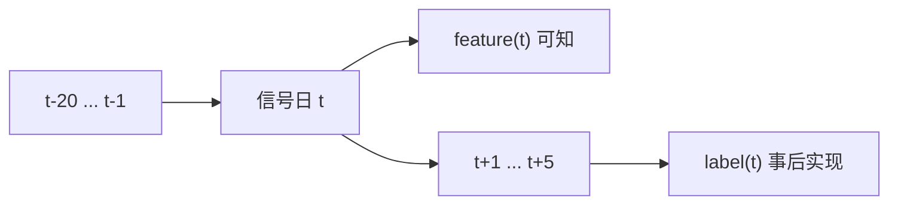

# 05：标签和时间切分

这一节用 Qlib 表达式同时读取特征和未来收益标签，重点检查金融时间序列任务里的时间方向。

## 图结构



样本时间线：



## Python 文件逐段拆解

### `fields`

脚本读取三列：

```python
fields = [
    "$close",
    "$close / Ref($close, 20) - 1",
    "Ref($close, -5) / $close - 1",
]
```

第二列是过去 20 日动量，能作为特征。第三列引用未来价格，只能作为标签。

### `load_features(...)`

这里仍然通过 `D.features` 一次性读取 feature 和 label。Qlib 会按 `datetime, instrument` 对齐两列，避免手工 merge 造成错位。

### `with_datetime_instrument_index(...)`

把索引统一成 `datetime, instrument`。这样下面可以直接按日期切片：

```python
train = data.loc[:train_end_time()]
test = data.loc[test_start_time():]
```

### `train_end_time()` / `test_start_time()`

这两个 helper 从环境变量读取切分点。它们的作用是把实验时间边界显式化，避免脚本里到处硬编码日期。

## 一次运行的完整执行轨迹

1. 初始化 Qlib。
2. `D.features` 读取收盘价、20 日动量和未来 5 日收益标签。
3. 删除空值。
4. 按时间切出 train 和 test。
5. 打印完整样本、训练区间和测试区间。

## 运行方式

```bash
QLIB_PROVIDER_URI=~/.qlib/qlib_data/cn_data python labels_and_time_splits.py
```

可选：

```bash
QLIB_TRAIN_END_TIME=2020-06-30
QLIB_TEST_START_TIME=2020-07-01
```

## 常见坑

- 用随机切分处理金融时间序列。
- 把未来收益标签写进 feature。
- 用测试期信息 fit 标准化参数。
- 信号日和成交日混在一起。

## 下一步

进入 `06-factor-evaluation`，用对齐后的 factor / label 计算 IC、RankIC 和分组收益。
