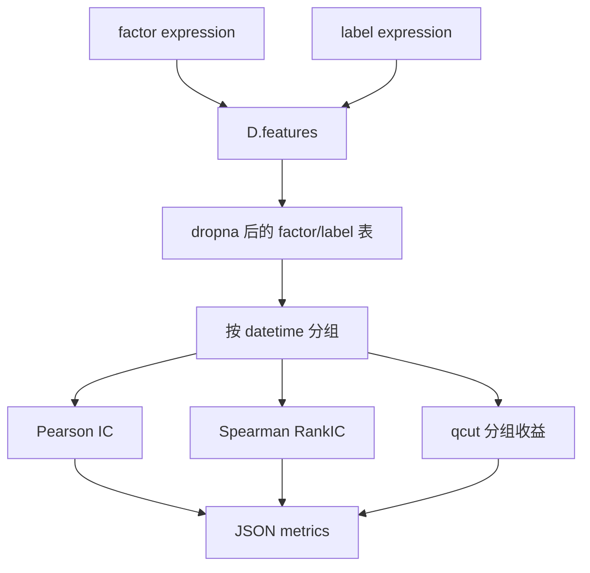

# 06：Qlib 单因子评估

这一节把一个候选 Qlib 表达式和一个未来收益标签对齐，计算 coverage、IC、RankIC、ICIR 和分组收益。它是自动因子评估服务的核心函数。

## 图结构



## Python 文件逐段拆解

### `DEFAULT_FACTOR` / `DEFAULT_LABEL`

默认候选因子：

```python
DEFAULT_FACTOR = "$close / Ref($close, 20) - 1"
```

默认标签：

```python
DEFAULT_LABEL = "Ref($close, -5) / $close - 1"
```

因子只看过去，标签看未来。这个边界是自动因子评估里最重要的安全线。

### `evaluate_factor(expression, label, quantiles=5)`

这是本节的核心函数。输入是两个 Qlib 表达式，输出是一个普通 Python `dict`，方便后续 CLI、Recorder 或 Agent 调用。

第一步调用：

```python
load_features([expression, label], ["factor", "label"])
```

底层仍是 `D.features`。Qlib 负责表达式计算和时间/标的对齐。

### `coverage`

```python
coverage = len(data.dropna()) / len(data)
```

coverage 衡量表达式计算后有多少样本可用。滚动窗口太长、字段缺失、停牌或表达式非法都会降低 coverage。

### IC

```python
g["factor"].corr(g["label"])
```

每天在横截面上计算 Pearson 相关系数。它回答：因子数值和未来收益数值是否同向变化？

### RankIC

```python
g["factor"].corr(g["label"], method="spearman")
```

每天在横截面上计算 Spearman 等级相关。它回答：因子排序和未来收益排序是否一致？选股研究通常更关注这个指标。

### ICIR

```python
ic_mean / ic_std
```

ICIR 衡量 IC 的稳定性。平均 IC 高但波动也高，未必是好信号。

### 分组收益

```python
pd.qcut(group["factor"].rank(method="first"), quantiles)
```

先按因子值做横截面分组，再计算每组未来收益均值。它用于观察因子是否有单调性。

## 一次运行的完整执行轨迹

1. 从环境变量读取 `QLIB_FACTOR_EXPR` 和 `QLIB_LABEL_EXPR`。
2. 初始化 Qlib provider。
3. `D.features` 计算 factor 和 label。
4. 按日期分组计算 IC、RankIC、分组收益。
5. 打印 JSON metrics。

## 运行方式

```bash
QLIB_PROVIDER_URI=~/.qlib/qlib_data/cn_data python factor_evaluation.py
```

可选：

```bash
QLIB_FACTOR_EXPR='$close / Ref($close, 20) - 1' \
QLIB_LABEL_EXPR='Ref($close, -5) / $close - 1' \
python factor_evaluation.py
```

## 常见坑

- 横截面标的太少，IC/RankIC 没有统计意义。
- 只看平均 IC，不看 IC 稳定性。
- 反复用测试期筛因子。
- 因子方向不统一，导致正负号解释混乱。

## 下一步

进入 `07-model-training-baseline`，把多个 Qlib 特征放进模型，生成样本外预测分数。
