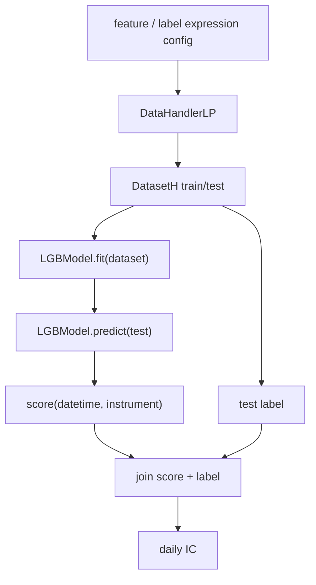

# 07：Qlib 模型训练基线

这一节使用 Qlib `DataHandlerLP`、`DatasetH` 和 `LGBModel` 训练 LightGBM 基线模型，并在 test segment 上产生样本外预测分数。

## 图结构



## Python 文件逐段拆解

### `FEATURE_FIELDS` / `LABEL_FIELDS`

这里定义模型输入和训练目标。特征包括动量、波动率、成交量比例，标签是未来收益。

Qlib 的关键点是：这些不是提前落盘的 CSV 列，而是交给 `QlibDataLoader` 计算的表达式。

### `build_dataset()`

这个函数创建：

```text
DataHandlerLP
  -> QlibDataLoader
  -> learn_processors
  -> DatasetH segments
```

`DataHandlerLP` 负责把表达式加载结果处理成训练/推理可用的数据。`DatasetH` 负责按时间段切出 `train` 和 `test`。

### `learn_processors`

脚本使用：

```text
DropnaLabel
ProcessInf
Fillna
```

这些 Processor 的作用是让训练数据更适合模型：删除无标签样本，处理无穷值，填补缺失特征。正式项目里还要特别注意 infer 和 learn 处理链一致性。

### `LGBModel`

`LGBModel` 是 Qlib 对 LightGBM 的模型封装。它的 `fit(dataset)` 会从 `DatasetH` 中取出 train segment 的 feature/label，再训练模型。

### `model.predict(dataset, segment="test")`

预测阶段只取 test segment 的 feature，输出：

```text
score(datetime, instrument)
```

score 是模型排序信号，不是策略收益。它后续还要进入 IC 评估或组合回测。

### `daily_ic`

脚本把 score 和 test label join 后，按日期计算横截面相关系数。这一步验证模型预测分数是否和未来收益有关系。

## 一次运行的完整执行轨迹

1. 初始化 Qlib。
2. 构造 `DataHandlerLP` 和 `DatasetH`。
3. `LGBModel.fit(dataset)` 训练模型。
4. `model.predict(..., segment="test")` 生成样本外 score。
5. 读取 test label，并计算 daily IC。

## 运行方式

```bash
QLIB_PROVIDER_URI=~/.qlib/qlib_data/cn_data python model_training_baseline.py
```

## 常见坑

- 用 test 数据参与训练或调参。
- 训练和推理处理链不一致。
- 把 label 混进 feature。
- 把 score 当成可交易收益。

## 下一步

进入 `08-recorder-and-experiment`，用 Qlib Recorder 保存参数、指标和 artifact。
