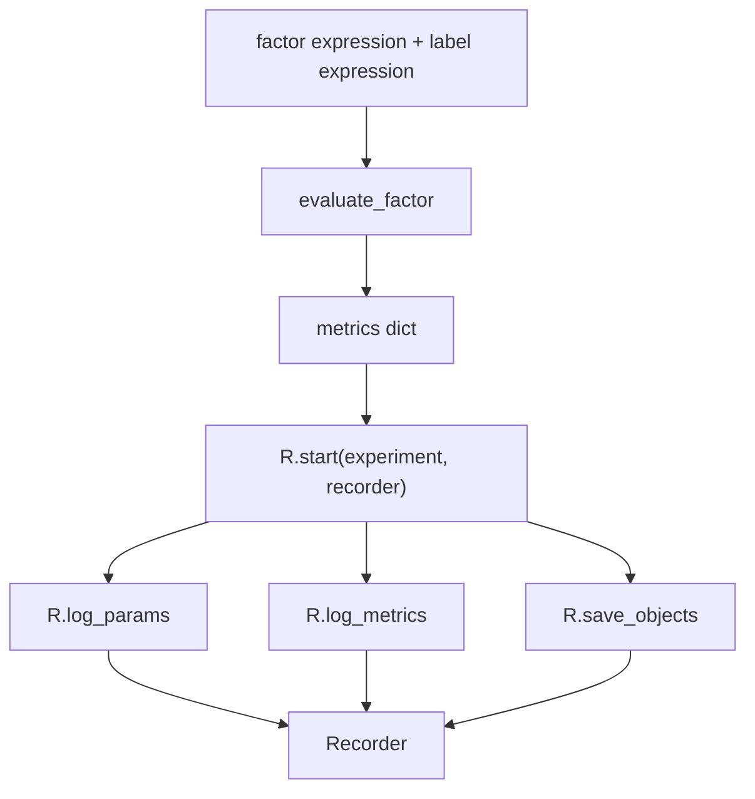

# 08：使用 Qlib Recorder 记录实验

这一节使用 Qlib 原生 `qlib.workflow.R`，把一次因子评估记录成 experiment / recorder。自动因子挖掘系统不能只看终端输出，每个候选表达式都要可追踪。

## 图结构



## Python 文件逐段拆解

### `expression` / `label`

脚本从环境变量读取候选因子和标签：

```bash
QLIB_FACTOR_EXPR=...
QLIB_LABEL_EXPR=...
```

如果没有传入，就使用 `06-factor-evaluation` 中的默认表达式。

### `evaluate_factor(...)`

这里复用第 6 节的确定性评估函数。Recorder 不负责计算指标，它负责保存指标和参数。

### `R.start(...)`

`R.start` 是 Qlib workflow 的实验上下文入口。它会创建或打开一个 experiment，并在上下文中绑定当前 recorder。

### `R.log_params(...)`

保存实验参数，例如 factor expression 和 label expression。参数用于回答：这次实验到底评估了什么？

### `R.log_metrics(...)`

保存数值指标，例如 coverage、IC、RankIC、ICIR。指标用于比较不同候选因子。

### `R.save_objects(...)`

保存 artifact。本节保存 `metrics.pkl`。正式项目里还可以保存预测结果、回测报告、模型对象、图表等。

## 一次运行的完整执行轨迹

1. 初始化 Qlib。
2. 计算因子评估 metrics。
3. 进入 `R.start` 上下文。
4. 记录 params、metrics 和 artifact。
5. 退出上下文，实验记录完成。

## 运行方式

```bash
QLIB_PROVIDER_URI=~/.qlib/qlib_data/cn_data python recorder_and_experiment.py
```

## 常见坑

- 只保存最终指标，不保存表达式。
- 多次运行覆盖本地文件，没有 experiment/recorder 边界。
- 只记录成功因子，不记录失败候选。

## 下一步

进入 `09-strategy-and-backtest`，把 Qlib 产生的 score 转成简化 top-k 组合检验。
