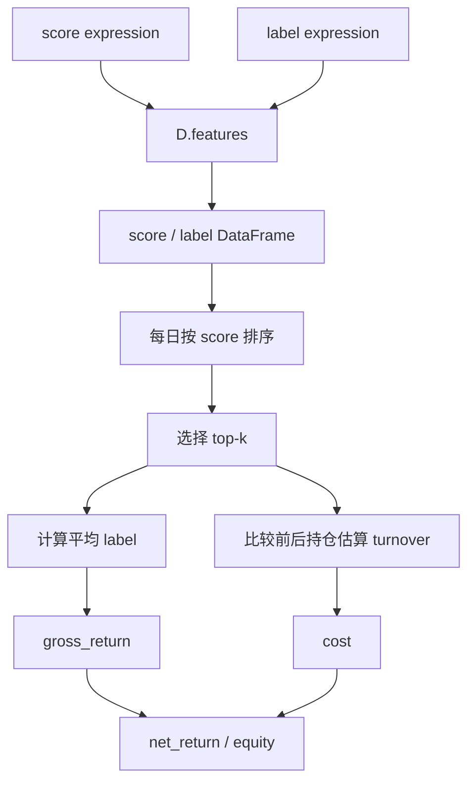
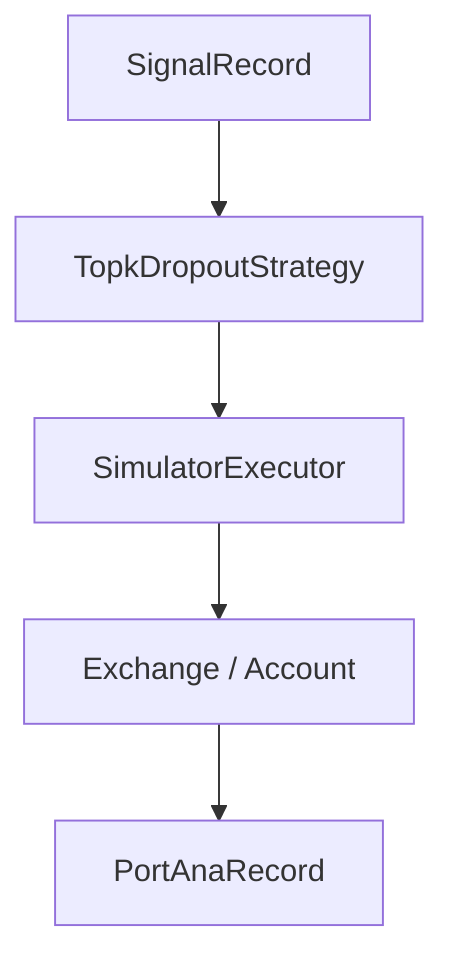

# 09：从 Qlib score 到简化 top-k 回测

这一节仍然用 Qlib `D.features` 生成 score 和 label，但回测逻辑保持轻量。目的不是替代 Qlib 原生回测，而是先看清模型分数如何变成组合收益。

## 图结构



## Python 文件逐段拆解

### `DEFAULT_SCORE` / `DEFAULT_LABEL`

`DEFAULT_SCORE` 是一个 Qlib 表达式，默认用 20 日动量作为排序信号。`DEFAULT_LABEL` 是下一持有期收益。

这两个表达式通过 `QLIB_SCORE_EXPR` 和 `QLIB_LABEL_EXPR` 覆盖。

### `load_features([score_expr, label_expr], ...)`

底层调用 `D.features`。Qlib 负责从 provider 读取字段、计算表达式并对齐 index。

### `topk`

脚本按每日横截面的 score 从高到低排序：

```python
picked = group.sort_values("score", ascending=False).head(topk)
```

这一步把预测层的 score 转成组合层的持仓集合。

### `turnover`

脚本比较今天和昨天的持仓集合：

```python
buys = current - previous
sells = previous - current
turnover = (len(buys) + len(sells)) / topk
```

这是简化估算，不处理成交量、涨跌停、现金和最小交易单位。完整版本见第 12 节。

### `net_return`

```python
net_return = gross_return - turnover * cost_rate
```

这里演示成本对策略收益的影响。很多高 IC 信号会因为高换手和成本失效。

## 一次运行的完整执行轨迹

1. 初始化 Qlib。
2. `D.features` 计算 score 和 label。
3. 每个交易日选 top-k。
4. 估算换手和成本。
5. 输出累计净值和平均换手。

## 运行方式

```bash
QLIB_PROVIDER_URI=~/.qlib/qlib_data/cn_data python strategy_and_backtest.py
```

可选：

```bash
QLIB_TOPK=50
QLIB_COST_RATE=0.001
```

## 和第 12 节的区别

本节是教学用简化回测。第 12 节会使用 Qlib 原生：



## 常见坑

- 把 IC 当成组合收益。
- 忽略换手和成本。
- 用单标的做 top-k 横截面策略。
- 忘记区分信号、策略、成交和账户状态。

## 下一步

进入 `10-config-driven-alpha-workflow`，把因子评估流程配置化。
