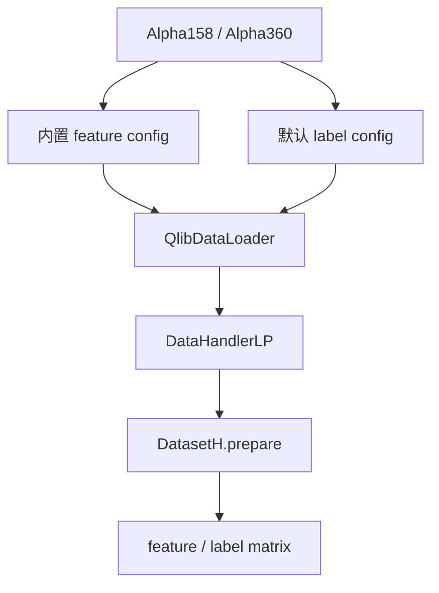
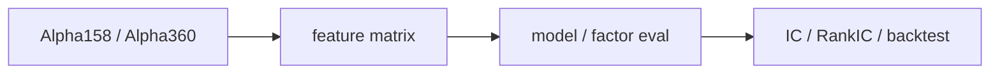

# 11：Alpha158 / Alpha360 特征集合

`Alpha158` 和 `Alpha360` 不是模型，也不是策略。它们是 Qlib 预定义的 `DataHandlerLP`，内部封装了 feature expression、label expression 和 processor 流程。

## 图结构



## Python 文件逐段拆解

### `preview_handler(handler_cls, name)`

这个函数接收 `Alpha158` 或 `Alpha360` 类，然后实例化 handler：

```python
handler = handler_cls(
    instruments=instruments(),
    start_time=start_time(),
    end_time=end_time(),
    fit_start_time=start_time(),
    fit_end_time=train_end_time(),
    infer_processors=[],
)
```

`instruments()` 读取共享的 `QLIB_INSTRUMENTS` 配置；未覆盖时，本仓库会使用随数据包提供的五只 ETF。当前示例显式传入 `infer_processors=[]`，直接预览特征表达式的输出，并规避当前 Qlib 默认 `ProcessInf` 与 pandas 2.1 的月末频率别名不兼容问题。因此，这里没有额外的 inference processor 标准化步骤。`fit_start_time` / `fit_end_time` 仍限定在训练期，便于以后增加需要拟合的 Processor 时避免数据泄漏。

### `Alpha158`

`Alpha158` 是人工设计的特征集合，包含 K 线形态、价格相对值、滚动统计、趋势类表达式等。它的价值是提供一个可复用 baseline feature set。

### `Alpha360`

`Alpha360` 更像固定历史窗口展开，把过去多日的 open/high/low/close/vwap/volume 表达式作为特征。部分表达式自身包含相对价格计算，但本示例没有再通过 inference processor 做标准化。它适合让模型自己从窗口中学习模式。

### `DatasetH.prepare(...)`

脚本把 handler 放进 `DatasetH`，再读取 train segment：

```python
dataset.prepare("train", col_set=["feature", "label"], data_key=DataHandlerLP.DK_L)
```

这一步说明 Alpha158/Alpha360 最终也只是生成 feature / label 表，后续仍要训练模型和评估。

## 一次运行的完整执行轨迹

1. 初始化 Qlib。
2. 实例化 `Alpha158`。
3. `DatasetH.prepare` 输出 Alpha158 训练表。
4. 实例化 `Alpha360`。
5. `DatasetH.prepare` 输出 Alpha360 训练表。
6. 打印 shape、feature 列数量和前若干列名。

## 运行方式

```bash
QLIB_PROVIDER_URI=~/.qlib/qlib_data/cn_data python alpha_feature_sets.py
```

## 核心原理

预定义特征集并不保证有效：



特征集合只是输入空间，是否有效仍要通过样本外评估和回测验证。

## 常见坑

- 以为 Alpha158/Alpha360 是模型。
- 以为预定义特征天然有效。
- 自定义因子不检查未来函数。
- Processor fit 区间覆盖了测试期。

## 下一步

进入 `12-native-backtest-architecture`，用 Qlib 原生 portfolio analysis 检验策略层表现。
