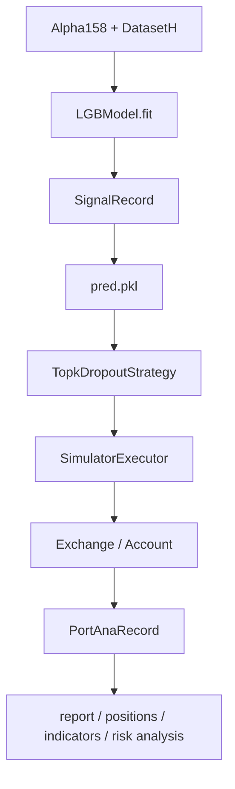
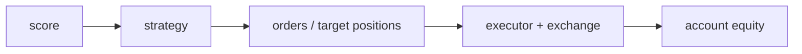

# 12：Qlib 原生组合回测

这一节使用 Qlib 原生组合回测链路：训练模型、保存预测信号、用 `TopkDropoutStrategy` 生成交易决策，再由 `SimulatorExecutor` 和 `PortAnaRecord` 完成组合分析。

## 图结构



## Python 文件逐段拆解

### `build_dataset()`

构造 `Alpha158` handler 和 `DatasetH`。这一步给模型提供 feature / label，也给后续 signal 生成提供 test segment。

### `build_port_analysis_config(model, dataset)`

这个函数返回 Qlib portfolio analysis 配置，分三块：

```text
executor
strategy
backtest
```

这和 Qlib YAML workflow 里的 `port_analysis_config` 是同一类结构。

### `SimulatorExecutor`

`SimulatorExecutor` 是 Qlib 的回测执行器。它按 `time_per_step="day"` 推进交易日，维护交易日历和账户执行过程。

### `TopkDropoutStrategy`

策略读取预测信号，选 top-k 股票，并用 `n_drop` 控制每天最多替换多少持仓。它的作用是把 score 转成交易决策，而不是计算模型分数。

### `exchange_kwargs`

这里配置交易市场假设：

```text
deal_price
open_cost
close_cost
min_cost
limit_threshold
```

这些参数决定成交价格、交易成本和涨跌停限制。模型 IC 不包含这些约束，组合回测才包含。

### `SignalRecord`

`SignalRecord(model, dataset, recorder).generate()` 会调用模型预测，并把预测结果保存成 Recorder artifact，通常是 `pred.pkl`。`PortAnaRecord` 后续依赖这个预测文件。

### `PortAnaRecord`

`PortAnaRecord` 会读取 `pred.pkl`，替换 strategy 配置里的 signal，然后运行 Qlib 原生 backtest。它会保存：

```text
report_normal_1day.pkl
positions_normal_1day.pkl
indicators_normal_1day.pkl
port_analysis_1day.pkl
```

## 一次运行的完整执行轨迹

1. 初始化 Qlib。
2. 构造 `Alpha158 + DatasetH`。
3. 训练 `LGBModel`。
4. `SignalRecord` 保存预测信号。
5. `PortAnaRecord` 用 Qlib strategy/executor/exchange/account 跑回测。
6. 脚本加载并打印 portfolio report 和 risk analysis。

## 运行方式

```bash
QLIB_PROVIDER_URI=~/.qlib/qlib_data/cn_data python native_backtest_architecture.py
```

可选：

```bash
QLIB_TOPK=50
QLIB_N_DROP=5
QLIB_BENCHMARK=SH000300
QLIB_DEAL_PRICE=close
```

## 核心原理

预测和投资组合是两个问题：



好 IC 不等于好策略。成本、换手、成交限制和 benchmark 都会改变最终表现。

## 常见坑

- 把 `pred.pkl` 当成回测结果。
- 忽略 `deal_price` 与信号生成时间的关系。
- benchmark 和 market 不匹配。
- top-k 太小导致组合过度集中。

## 下一步

进入 `13-custom-data-provider`，学习如何把自己的数据整理成 Qlib provider。
