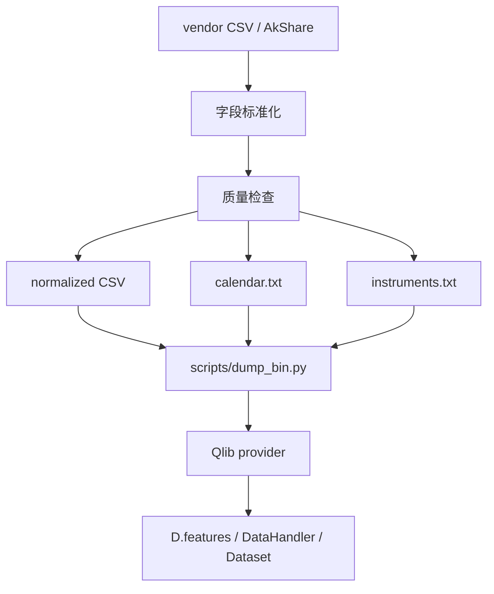
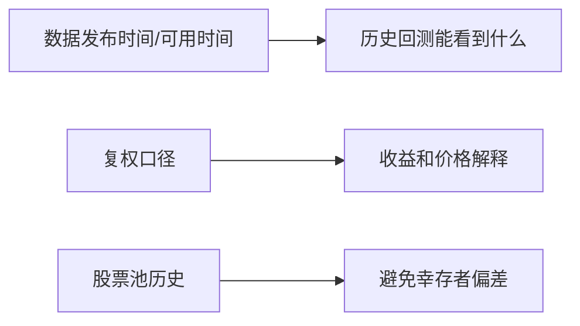

# 13：接入自有金融数据

这一节说明如何把外部行情数据整理成 Qlib 可转换输入。它不是研究主流程 fallback，而是 provider 构建前的数据准备步骤。

## 图结构



## Python 文件逐段拆解

### `custom_data_provider.py`

这个脚本演示最小数据检查和元数据生成。

#### `REQUIRED_COLUMNS`

日频行情至少需要：

```text
symbol, date, open, high, low, close, volume, factor
```

`factor` 用于复权口径。价格、收益和回测解释必须使用一致口径。

#### `validate_raw_data(frame)`

检查：

- 必要字段是否存在；
- 日期是否可解析；
- OHLC 是否为正；
- volume 是否非负；
- `symbol/date` 是否重复。

Provider 层数据不干净，后续 expression、handler、dataset 都会继承问题。

#### `calendar.txt` / `instruments.txt`

Qlib provider 需要交易日历和标的有效区间。脚本从原始数据中生成这两个文件，帮助理解 provider 的基本结构。

#### `dump_bin_command.txt`

脚本输出可交给 Qlib 官方 `scripts/dump_bin.py` 的命令。真正生成 `.bin` provider 应使用 Qlib 官方转换工具。

### `build_hs300_etf_from_akshare.py`

这个脚本用 AkShare 下载 `510300` ETF 日线，并生成 Qlib-ready CSV 包。

#### `fetch_etf_daily()`

从 AkShare 获取原始行情。它依赖网络和数据源稳定性，因此适合构建样例数据，不应混入研究主流程。

#### `normalize(raw)`

把中文字段名统一成 Qlib 常用字段：

```text
date, open, high, low, close, volume, amount, factor
```

#### `validate(frame)`

执行基本质量检查。正式项目还需要检查停牌、涨跌停、复权跳变、退市和成分股历史。

#### `write_outputs(frame)`

写出 CSV、calendar、instruments、README 和 dump command。

## 一次运行的完整执行轨迹

1. 读取外部 CSV 或 AkShare 数据。
2. 标准化字段名和日期格式。
3. 运行质量检查。
4. 生成 calendar 和 instruments。
5. 生成 dump_bin 命令。
6. 使用 Qlib 官方脚本转换成 provider。
7. 后续通过 `D.features` 验证可读取。

## 运行方式

最小本地示例：

```bash
python custom_data_provider.py
```

AkShare 示例：

```bash
python build_hs300_etf_from_akshare.py
```

## 核心原理

自有数据接入的关键是 point-in-time 和口径一致：



## 常见坑

- 用普通 CSV 目录当作 `QLIB_PROVIDER_URI`。
- 财务数据按报告期而不是公告可用日入库。
- 价格复权口径和 label 口径不一致。
- 只保留现存股票，产生幸存者偏差。

## 下一步

进入 `14-factor-evaluation-service`，把 Qlib provider、表达式和评估函数收口成可调用服务。
