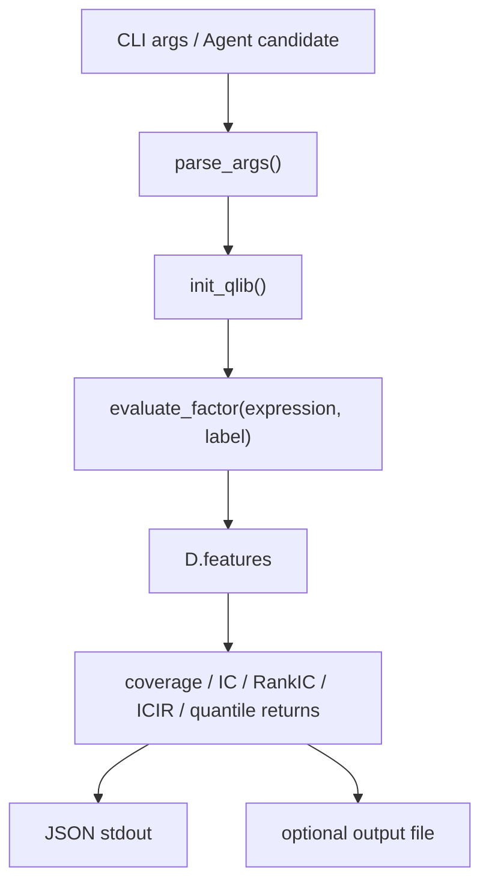
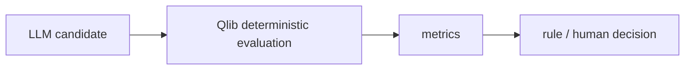

# 14：自动因子评估服务

这一节把 Qlib 数据读取、表达式计算、标签构造和指标评估收口成一个 CLI。它是后续 Agent / LangGraph 自动因子挖掘系统可以调用的确定性入口。

## 图结构



## Python 文件逐段拆解

### `parse_args()`

定义 CLI 参数：

```text
--expression
--label
--output
```

这让外部系统可以把候选因子表达式作为参数传入，而不是修改源码。

### `init_qlib()`

服务启动后先初始化 Qlib provider。没有 provider 时直接失败，因为评估必须由 Qlib 数据层确定性计算。

### `evaluate_factor(args.expression, args.label)`

复用第 6 节的核心函数。这样 CLI 只是薄封装，指标逻辑集中在一个地方，便于测试和复用。

### `--output`

如果传入输出路径，脚本把 JSON metrics 写入文件；否则打印到 stdout。Agent 调用时通常读取 stdout 或指定 output file。

## 一次运行的完整执行轨迹

1. Agent 或用户传入候选表达式。
2. CLI 解析参数。
3. 初始化 Qlib。
4. 调用 `evaluate_factor`。
5. 输出 JSON 指标。
6. 上游系统根据指标决定接受、拒绝或继续观察。

## 运行方式

```bash
QLIB_PROVIDER_URI=~/.qlib/qlib_data/cn_data \
python factor_evaluation_service.py \
  --expression '$close / Ref($close, 20) - 1' \
  --label 'Ref($close, -5) / $close - 1'
```

输出到文件：

```bash
python factor_evaluation_service.py \
  --expression '$close / Ref($close, 20) - 1' \
  --output artifacts/mom20.json
```

## 输出 schema

```json
{
  "expression": "$close / Ref($close, 20) - 1",
  "label": "Ref($close, -5) / $close - 1",
  "rows": 12345,
  "coverage": 0.98,
  "ic_mean": 0.02,
  "rank_ic_mean": 0.03,
  "icir": 0.4,
  "rank_icir": 0.5,
  "quantile_return_mean": {}
}
```

## 核心原理

LLM/Agent 可以生成候选，但不能凭语言判断因子好坏：



数值计算、时间对齐、缺失处理和评估记录必须由确定性程序完成。

## 常见坑

- 让 Agent 直接解释因子好坏，不跑数据。
- 没有固定 label 和时间区间，导致候选不可比。
- 单标的评估 IC，缺少横截面意义。
- 不保存失败候选。
