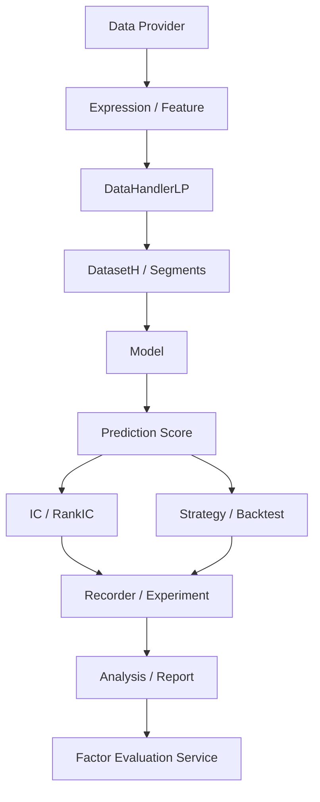
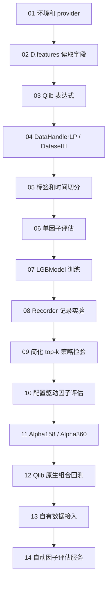

# Qlib 从基础到完整可运行示例

这是一条面向“已有一点金融和 Python 基础”的 Qlib 学习路径。每个子目录都尽量使用 **Microsoft Qlib 原生接口**：`qlib.init`、`D.features`、`DataHandlerLP`、`DatasetH`、`LGBModel`、`R` 等。少量脚本用于准备自有数据，但研究主流程不再回退到内置小 CSV。

Qlib 官方定位是 AI-oriented Quant investment platform，覆盖数据、特征、Dataset、模型、工作流、回测和实验记录。本目录不重复讲 Python/Pandas 基础，只保留必要的量化研究语义。

这条路径的目标不是“把 Qlib 所有 API 都扫一遍”，而是回答一个更实际的问题：

```text
如何从数据读取开始，一步步做出一个可运行、可复现、可记录、可回测的 Alpha 研究流程？
```

## 先理解 Qlib 的主线

可以把 Qlib 的核心工作流压缩成这张图：



本目录的示例就是按这条链铺开的。前几节直接进入 Qlib Data API 和表达式引擎，中间使用 Qlib 原生 Handler/Dataset/Recorder，最后收口为可由自动因子挖掘系统调用的 factor evaluation service。

## 运行准备

需要安装 Microsoft Qlib：

```bash
pip install pyqlib pandas numpy lightgbm
```

如果环境里误装了另一个名为 `qlib` 的包，需要先移除它，否则 `import qlib` 可能不会导入 Microsoft Qlib。

所有研究类 demo 都需要 Qlib provider：

```bash
export QLIB_PROVIDER_URI=~/.qlib/qlib_data/cn_data
```

## 内置宽基 ETF 数据

运行数据准备脚本会生成供这些 demo 共用的五只宽基 ETF 教学数据：

```bash
python qlib-demos/download_to_qlib.py
```

| Qlib 标的 | 源代码 | 指数 |
|---|---|---|
| sh510050 | 510050 | 上证50 |
| sh510300 | 510300 | 沪深300 |
| sh510500 | 510500 | 中证500 |
| sz159915 | 159915 | 创业板 |
| sh588000 | 588000 | 科创50 |

Provider 的交易日历取五只 ETF 日期的并集；每只 ETF 仍保留自己的实际上市区间，对齐到并集日历时，上市前的数据不可用并显示为 NaN。这组数据只用于教学，不代表生产股票池。各节 `run.sh` 默认使用这五只 ETF；调用方也可以在运行前设置 `QLIB_INSTRUMENTS` 覆盖默认值，例如：

```bash
QLIB_INSTRUMENTS=sh510300 bash qlib-demos/03-qlib-expressions/run.sh
```

可选参数：

```bash
export QLIB_MARKET=csi300
export QLIB_START_TIME=2020-01-01
export QLIB_END_TIME=2020-12-31
export QLIB_TRAIN_END_TIME=2020-06-30
export QLIB_TEST_START_TIME=2020-07-01
```

## 学习路径

| # | 目录 | 主题 | 新增能力 |
|---|---|---|---|
| 1 | [`01-environment-and-data`](01-environment-and-data) | 环境和数据入口 | 检查 Microsoft pyqlib、`QLIB_PROVIDER_URI`、交易日历 |
| 2 | [`02-qlib-data-api`](02-qlib-data-api) | Qlib Data API | `qlib.init`、`D.features`、字段读取 |
| 3 | [`03-qlib-expressions`](03-qlib-expressions) | Qlib 表达式 | `$close`、`Ref`、`Mean`、`Rank` 的研究含义 |
| 4 | [`04-data-handler-and-dataset`](04-data-handler-and-dataset) | Handler / Dataset | 特征列、标签列、segment prepare |
| 5 | [`05-labels-and-time-splits`](05-labels-and-time-splits) | 标签和时间切分 | forward return、train/valid/test、避免随机打乱 |
| 6 | [`06-factor-evaluation`](06-factor-evaluation) | 因子评估 | IC、Rank IC、分组收益 |
| 7 | [`07-model-training-baseline`](07-model-training-baseline) | 模型训练基线 | `LGBModel`、预测分数、样本外 IC |
| 8 | [`08-recorder-and-experiment`](08-recorder-and-experiment) | 实验记录 | params、metrics、artifacts、可复现记录 |
| 9 | [`09-strategy-and-backtest`](09-strategy-and-backtest) | 策略和回测 | top-k、换手、成本、Qlib strategy/backtest 对应关系 |
| 10 | [`10-config-driven-alpha-workflow`](10-config-driven-alpha-workflow) | 配置驱动因子评估 | 用配置固定表达式、标签和输出 |
| 11 | [`11-alpha158-alpha360-feature-sets`](11-alpha158-alpha360-feature-sets) | Alpha158 / Alpha360 | 预定义特征集合的本质和自定义因子扩展 |
| 12 | [`12-native-backtest-architecture`](12-native-backtest-architecture) | 原生组合回测 | `SignalRecord`、`TopkDropoutStrategy`、`PortAnaRecord` |
| 13 | [`13-custom-data-provider`](13-custom-data-provider) | 自有数据接入 | CSV/Parquet 到 Qlib format 的字段、目录、校验思路 |
| 14 | [`14-factor-evaluation-service`](14-factor-evaluation-service) | 自动因子评估服务 | 输入 Qlib 表达式，输出 JSON 指标 |

## 每节之间怎么衔接



如果你已经熟悉 Pandas 和量化标签，可以从 `02-qlib-data-api` 开始。但建议至少快速跑一遍 `01`，确认当前环境有没有真实 Qlib 数据。

## 贯穿原则

- 不随机打乱金融时间序列。
- 模型分数不是交易收益，必须经过回测和成本检验。
- LLM/Agent 可以编排研究流程，但数值真值由确定性 Python、Pandas、NumPy 或 Qlib 计算。
- 每个实验都要能复现：固定输入、固定时间区间、固定输出路径。

## 为什么不再使用内置小数据作为主路径

这些 demo 的目标是理解 Qlib 核心流程，并服务于自动因子评估。因此主路径必须真实经过 Qlib provider、表达式引擎、Handler/Dataset 和 Recorder。没有 provider 时应尽早失败，而不是静默回退到本地 CSV。

`13-custom-data-provider` 保留 CSV 处理，是因为它演示的是“如何把外部数据整理成 Qlib 可转换输入”，不是研究主流程。

## 和正式 Qlib 项目的差距

这个目录是学习路径，不是生产模板。它仍然简化了很多正式项目必须处理的问题：

- 大规模股票池和交易日历
- 复杂模型和深度模型
- 原生 portfolio analysis 的完整报告模板
- benchmark、风险归因、容量和交易约束

这些没有被忽略，而是被推迟。当前重点是把自动因子评估所需的确定性链路跑通。

## 建议的学习方式

每个目录都按同样节奏学习：

1. 先读 README 的 Mermaid 图，弄清楚这一节在 Qlib 总链路中的位置。
2. 直接运行脚本，确认能看到输出。
3. 改一个小参数，例如日期、特征窗口、top-k 数量或成本率。
4. 再读 README 的“Python 文件逐段拆解”，看输出变化从哪里来。
5. 最后想清楚这一节在完整 Alpha workflow 里负责哪一层。

不要一上来就改成很复杂的股票池和超长时间段。先用 `csi300`、较短区间和少量表达式把 Qlib 语义走通，再扩大数据规模。

## 官方文档入口

- Qlib Data Layer: https://qlib.readthedocs.io/en/latest/component/data.html
- Qlib Workflow: https://qlib.readthedocs.io/en/latest/component/workflow.html
- Qlib GitHub: https://github.com/microsoft/qlib

## 问题覆盖矩阵

完成这些示例后，可以系统回答这些问题：

| 问题 | 主要对应章节 |
|---|---|
| Qlib 解决了量化研究中的哪些问题 | 01、08、10、12 |
| Qlib 数据为何不是普通 CSV | 01、02、13 |
| Provider、DataLoader、DataHandler 和 Dataset 分别负责什么 | 02、04、11、13 |
| Alpha158、Alpha360 本质上是什么 | 11 |
| 如何用 Qlib 表达式实现自定义因子 | 03、11 |
| 标签、特征和预测分数之间是什么关系 | 04、05、07 |
| IC、RankIC、分层收益和组合回测分别衡量什么 | 06、09、12 |
| 模型预测结果为什么不能直接等同于策略收益 | 07、09、12 |
| Strategy、Executor、Exchange 和 Account 如何共同完成回测 | 12 |
| 如何记录、复现和比较实验 | 08、10 |
| 如何接入自己的金融数据 | 13 |
| 如何将 Qlib 用作自动因子挖掘系统的确定性评估引擎 | 06、08、10、11、13、14 |

## 完成后能做什么

跑完这些示例后，你应该能独立解释并实现：

- 如何检查 Qlib 环境和数据入口。
- 如何用 Qlib Data API 读取基础字段。
- 如何把表达式理解成时间序列和横截面计算。
- 如何构造特征、标签和时间切分。
- 如何用 IC/Rank IC 做单因子评估。
- 如何训练一个最小模型并产生样本外 score。
- 如何记录实验参数、指标和 artifact。
- 如何把 score 转成策略回测。
- 如何用配置驱动一条完整 Alpha workflow。
- Alpha158 / Alpha360 这类预定义特征集合到底是什么。
- Qlib 原生回测里 Strategy、Executor、Exchange、Account 的职责边界。
- 自有数据接入 Qlib 前需要满足哪些字段、目录和质量约束。
